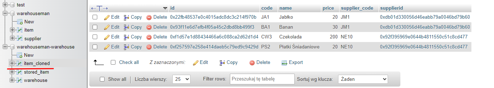
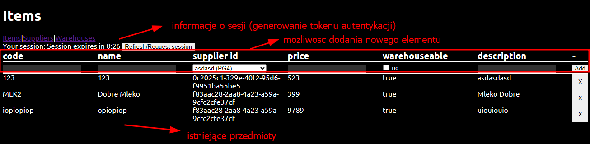
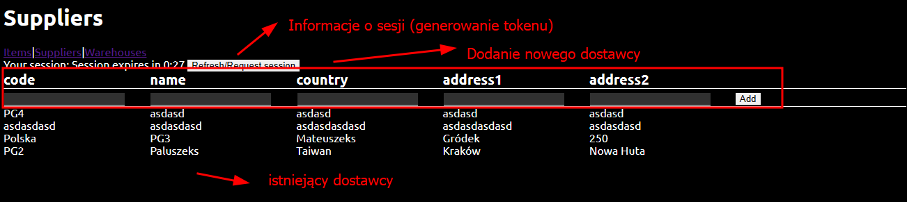
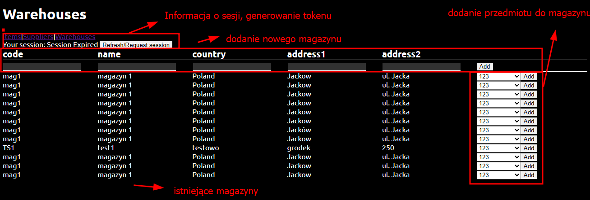

# Warehouseman
Prosta aplikacja utilizująca zastosowanie mikroserwisów w celu stworzenia rozwiązania webowego do zarządzania produktami i magazynem firmy z prostym systemem przydziału czasowego dostępu do usługi.

# Usługi
Projekt składa się z:
- trzech microserwisów backendowych
    - auth - odpowiada za autoryzacje
    - product - odpowiada za zarządzanie produktami i dostawcami
    - warehouse - odpowiada za zarządzanie magazynami i partiami produktów w nich
- biblioteki utilisowej do aplikacji backendowych (`lib`)
- statycznej strony frontendowej - interfejs do korzystania z aplikacji

# Komunikacja
- Microserwis auth jest wymaganym microserwisem dostarczającym autoryzacji, bez niego żadna operacja nie moze zostać autoryzowana.
- Microserwisy product i warehouse używają protokołu http do komunikacji z microserwisem auth by weryfikować tokeny przesłane w requestach
- Microserwis warehouse używa protokołu http by pobierać dane z mikroserwisu product. Jezeli microserwis product nie jest dostępny, to microserwis warehouse wykorzysta lokalną kopię bazy danych

# Zadanie - Wymogi uzasadnienie

## 3.0

**Opcja I** (wykonana)

- **Utworzenie REST API do obsługi operacji na wybranych danych** - projekty auth, product, warehouse wystawiają endpointy w stylu RESTapi
- **Walidacja zapytań i zabezpieczenie przed nieprawidłowymi zapytaniami** - Java Bean Validations użyte w klasach DTO (+ @Valid w interfejsach kontrolerów) - pakiet `.../application/dtos/` ([product](./warehouseman-product/src/main/java/pl/krakow/uken/mateuszjachowicz/warehouseman/product/application/dtos/), [warehouse](./warehouseman-warehouse/src/main/java/pl/krakow/uken/mateuszjachowicz/warehouseman/warehouse/application/dtos/))
- **Dane zapisane w wybranej bazie danych** - MySQL (możliwa zmiana silnika na inny silnik SQL'owy) - wykorzystanie JPA i Hibernate.

**Opcja II**

- **Utworzenie prostego interfejsu dla użytkownika do obsługującego wybrane REST API** - aplikacja [frontend](./warehouseman-frontend/) udostępnia prosty interfejs użytkownika i wykorzystuje REST API

## 4.0
- **Utworzenie formularza do dodawania nowych danych** - [warehouseman-frontend](./warehouseman-frontend/public/index.html)
- **Prezentacja danych przez przeglądarkę** - [warehouseman-frontend](./warehouseman-frontend/public/index.html)
- **Walidacja danych wprowadzanych przez formularz** - Aplikacje backendowe bean + weryfikacja lokalna
- **Rozszerzenie REST API o możliwość dodawania danych przez zapytania** - endpointy:
    - (product) `POST /items`
    - (product) `POST /suppliers`
    - (warehouse)`POST /warehouse/{id}/items`
- **Zabezpieczenie API np. przez klucz / token** - Microserwis auth + `MyAuthFilter` w product/warehouse. Każde zapytanie musi w headerze podać wygenerowany token.
- **Pozostałe wymogi jak na ocenę 3.0** - [uzasadniono wyżej](#30)

## 5.0
- **Podział aplikacji na mikro usługi, każda odpowiedzialna za określone zadania** - Microserwis [auth](./warehouseman-auth/), [product](./warehouseman-product/), [warehosue](./warehouseman-warehouse/)
- **Wykorzystanie kilku baz danych do przechowywania danych** - Mikroserwisy używają swoich niezależnych baz danych. Mogą pochodzić z jednego SZBD lub różnych, nawet z różnych hostów.
- **Mechanizm synchronizacji danych między bazami danych** - microserwis warehouse wykonuje spłaszczoną kopię danych z microserwisu product by w wypadku braku dostępu do mikroserwisu product (np. mikroserwis wyłączony) korzystać z kopii - klasa [ItemClonedServiceImpl](./warehouseman-warehouse/src/main/java/pl/krakow/uken/mateuszjachowicz/warehouseman/warehouse/internal/services/ItemClonedServiceImpl.java)
(Podgląd synchronizacji z poziomu panelu phpmyadmin). Przedmioty są synchronizowane w momencie połączenia danego przedmiotu z magazynem.

- **Pozostałe wymogi jak dla oceny 3.0 i 4.0** - [uzasadniono wyżej](#40)

# Uruchomienie 
1. Pobrać javę 17 lub nowszą (zalecana Java 17 Temurin)
2. Ustawić parametry JAVA_HOME na ścieżkę do katalogu Javy 17 (z kroku wcześniej)
3. Pobrać Maven 3.9.5 lub nowszy (zalecany 3.9.5)
4. Uruchomic ulubiony SZBD MySQL
    1. Zaimportować załączone bazy danych: `warehouseman` i `warehouseman-warehouse`
    2. Wystawić SZBD MySQL na `localhost:3306`.
5. Uruchomić wybrane usługi
    1. Wejść do folderu usługi (np. Warehouseman-auth)
    2. Wykonać plecenie maven do uruchomienia aplikacji spring-boot: `mvn spring-boot:run`
6. Przejść do katalogu `warehouseman-frontend`
    1. Uruchomić stronę poprzez otwarcie pliku `index.html` w przeglądarce internetowej.
    2. Frontend będzie wysyłać requesty na adres `localhost` na porty skonfigurowane wewnątrz aplikacji backendowych.

Możliwe jest zmienienie silnika bazodanowego i portów po przez dostosowanie ustawień w pliku `application.yaml` wewnątrz projektów auth, product, warehouse, lub przez przekazanie odpowiednich zmiannych środowiskowych Springa.

# Przedmioty (index.html):

# Dostawcy (suppliers.html):

# Magazyny (warehouses.html)

